<p align="center">
  <picture>
    <source media="(prefers-color-scheme: dark)" srcset="assets/logo-dark.png">
    
  </picture>
</p>

<p align="center">
  <strong>Diagrams of your system that cite their sources — and say what they could not see.</strong>
</p>

<p align="center">
  <a href="https://www.npmjs.com/package/mirofy-cli"></a>
  
  
  
  
</p>

<p align="center">
  <a href="https://hasan-laraib.github.io/Mirofy/gallery/architecture--classic.html">
    <picture>
      <source media="(prefers-color-scheme: dark)" srcset="assets/viewer-hero-dark.png">
      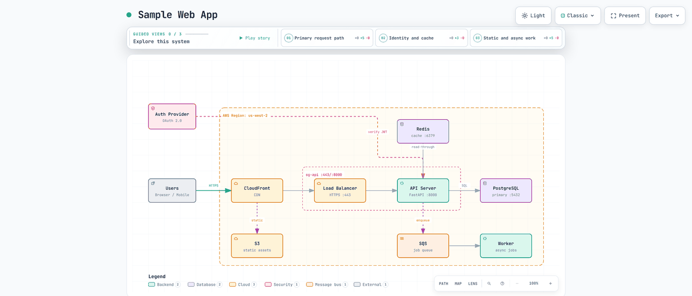
    </picture>
  </a>
</p>

<p align="center">
  <em>This is the whole product: one HTML file, open in a browser. Every colour
  in it is the system&rsquo;s own vocabulary &mdash; backend, database, cloud,
  security, message bus, external &mdash; and nothing else. Colour never marks
  where an arrow goes, only what a thing <strong>is</strong>.</em>
  <br>
  <strong><a href="https://hasan-laraib.github.io/Mirofy/gallery/architecture--classic.html">Open this exact file ↗</a></strong> &mdash;
  click any node for its evidence, trace what reaches it, search it, present it.
</p>

---

## What it is

Point Mirofy at a repository. It reads the code into an **evidence graph**,
builds a **model** from that graph, and compiles the model into **one HTML
file** you can open, search, share and check.

Every relationship it draws can answer one question: *what is the evidence for
this?* Each carries the file, the line range and the commit it came from. Where
nothing is known, the diagram **says so** instead of filling the gap.

<p align="center">
  
</p>

Run it against this repository and you get this — not a mock-up, and not drawn
by hand:

<p align="center">
  <a href="https://hasan-laraib.github.io/Mirofy/self-model.html"></a>
</p>

<p align="center">
  <em>Every box is the same colour here, and that is the point. All twelve of
  these are the same thing — a package, derived from a manifest — so there is
  nothing for colour to say, and it says nothing. The picture at the top is
  colourful because that system genuinely has six kinds in it. A tool that
  tinted these boxes to look livelier would be inventing a distinction it had
  not found.</em>
  <br>
  <strong><a href="https://hasan-laraib.github.io/Mirofy/self-model.html">Open the live one ↗</a></strong> — click any
  node for the file, line range and commit behind it.
</p>

## Install

**Nothing to install** — one command, and a diagram opens:

```bash
npx mirofy-cli map .    # YOUR repository, mapped, in one command
npx mirofy-cli demo     # a finished artifact, to see what this produces
npx mirofy-cli init     # a starter document of your own to edit
npx mirofy-cli render architecture architecture.json
```

`map` runs the whole pipeline in the directory you point it at — scan, model,
compile, layout, render — and writes `architecture.html` next to your code.
`map --out <dir>` sends the diagram and the intermediates there instead, so
nothing lands in your repository; without it the intermediates go to
`<target>/scan`. Naming an output path still wins over both. It works on a repository that declares no
workspaces: where there are no packages to draw, it models the **source
directories** and the imports between them.

### What it reads

**JavaScript and TypeScript** imports · **Python** imports · **Go** imports ·
**Java** imports · `package.json` workspaces · Express and Next routes ·
`docker-compose`.

That is the whole list, and the list is the point. Everything else is
**reported, not skipped**: `coverage.md` names every file no adapter opened,
grouped by type, and `map` says so on its way out when the unread files
outnumber the read ones. Point it at a Rust repository and you get an honest
empty answer naming every unread `.rs` file — not a confident small one drawn
from the two JavaScript files in an `examples/` folder.

Python resolves by **file existence**, not by convention: relative imports
against the importing file's directory, absolute ones against the repository
root and any directory that actually holds a package. A specifier that matches
two source roots is a gap naming both, because which one wins depends on
`sys.path`, which is configuration and not in the source.

Go resolves against the module path `go.mod` **declares**, and decides the
standard library the way the toolchain does — a first path segment containing a
dot is a domain, and a domain means a module fetched from somewhere. Java
builds its index from the `package` statements files **declare**, not from
directory layout: Maven convention puts `com.acme.store` under
`src/main/java/com/acme/store` and convention is not always, but the
declaration is what the compiler reads. In both, an import that names
something inside this repository which is not there is a gap — never a
dependency on a published copy of yourself.

`npx mirofy-cli guide "show an API request with a cache miss"` picks the
diagram type for you if you are not sure which one you want.

**As a CLI you keep** — `npm install -g mirofy-cli`. The command it installs is
**`mirofy`**; the package carries the `-cli` suffix because npm refused the bare
name as too close to the existing `minify`.

**From source** — no install at all, because there is nothing to install:

```bash
git clone https://github.com/Hasan-Laraib/Mirofy.git
node Mirofy/packages/core/bin/mirofy.mjs demo
```

That works on a bare checkout with no `npm install`, because every package here
has zero runtime dependencies.

**As an agent skill** — build the bundle and copy it where your agent looks:

```bash
git clone https://github.com/Hasan-Laraib/Mirofy.git
cd Mirofy && npm install && npm run build:skill

cp -r dist/mirofy ~/.claude/skills/      # Claude Code
cp -r dist/mirofy ~/.agents/skills/      # Codex CLI, opencode
```

Then ask: `Use mirofy to map this repository's runtime architecture.`

The bundle is 2.8 MB and named for the skill inside it — copying `packages/core`
instead installs a skill called `core` that says in its own frontmatter it is
called `mirofy`, and drags the test suite along with it. Before writing the
bundle, `build:skill` copies it somewhere with no repository around it and
renders a diagram: a bundle that only works inside its own checkout is not a
bundle.

Nothing is downloaded at runtime and nothing phones home — there is no update
check, because a tool that reaches the network to tell you about itself is a
tool that reaches the network.

## The pipeline, one step at a time

`mirofy map` is these five steps in order. Run them yourself when you want to
keep an intermediate, or point a step somewhere else:

```bash
npm run scan                    # repository  → evidence graph
npm run model -- --from-graph --graph scan/evidence-graph.json
npm run compile                 # model       → a bounded view
npm run layout                  # view        → positioned document
node packages/core/bin/mirofy.mjs render architecture scan/diagram.json out.html --repo-root .
```

Against **this repository** it records **1,100 facts** across **198 files**,
with **14 gaps** it could not read; derives **18 components and 20
relationships** — every one citing the file and line it came from — and draws
**twelve**, recording what it left out and why.

Those figures are checked, not remembered — see
[the numbers on this page](#what-is-proved) below.

Those commands reproduce the diagram at the top of this page. It is checked in
under `assets/` as documentation; the interactive artifacts are built, never
stored.

No repository? Author a JSON document, or convert a Mermaid diagram:

```bash
node packages/core/bin/mirofy.mjs import mermaid design.mmd
node packages/core/bin/mirofy.mjs render architecture design.json out.html
node packages/core/bin/mirofy.mjs validate architecture design.json --json
```

## What you get

<p align="center">
  
</p>

<p align="center">
  <em>Open any edge and it tells you why it is on the page: the relation, its
  provenance class, the file and line it came from, and the commit it was
  checked against. Underneath is the half most tools leave out — what the
  scanner could <strong>not</strong> determine, written down instead of guessed.
  <br>
  That record is real, and taken from this repository. So is the gap.</em>
</p>

Three claims about the pictures below, each with the thing that keeps it honest.

<table>
<tr>
<td width="50%" valign="top">
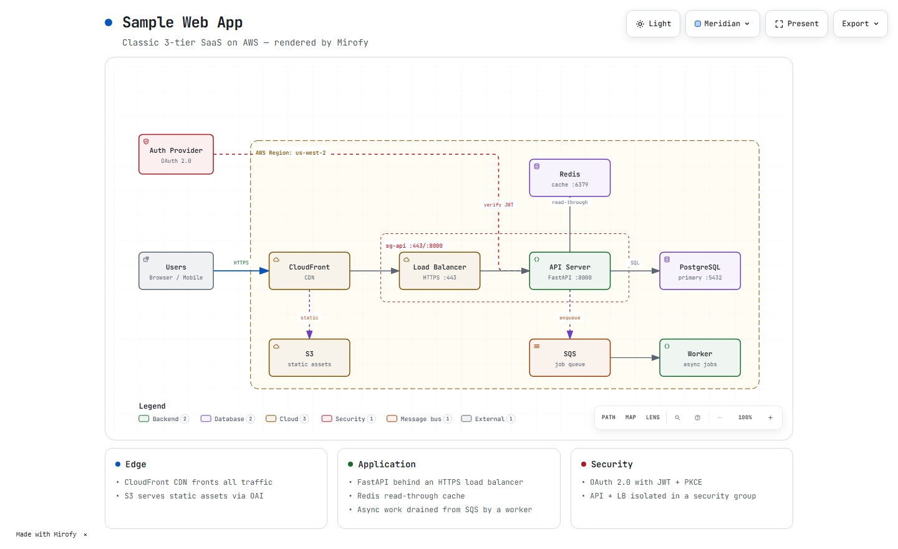
<p><strong>Colour tells you what a node is, never where an arrow goes.</strong>
Six presets, light and dark. <code>meridian</code> holds every arrow at graphite
so hue is never doing two jobs at once.
<br>
<sub>Proved by conformance row 4.16 · <a href="https://hasan-laraib.github.io/Mirofy/gallery/architecture--meridian.html">open this exact artifact ↗</a></sub></p>
</td>
<td width="50%" valign="top">
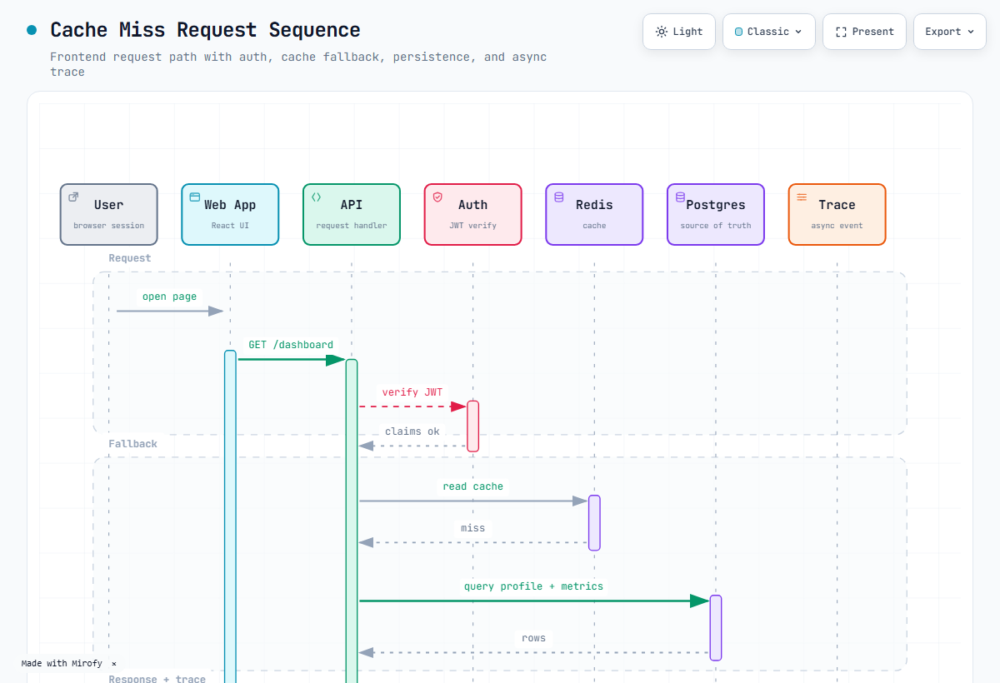
<p><strong>Five diagram types, one schema, one validator.</strong>
architecture · workflow · sequence · dataflow · lifecycle — the same typed IR
behind all of them.
<br>
<sub>Proved by conformance row 1.1, which renders all five from their baseline
fixtures in one pass · <a href="https://hasan-laraib.github.io/Mirofy/gallery/sequence--meridian.html">open this exact artifact ↗</a></sub></p>
</td>
</tr>
</table>

<p align="center">
  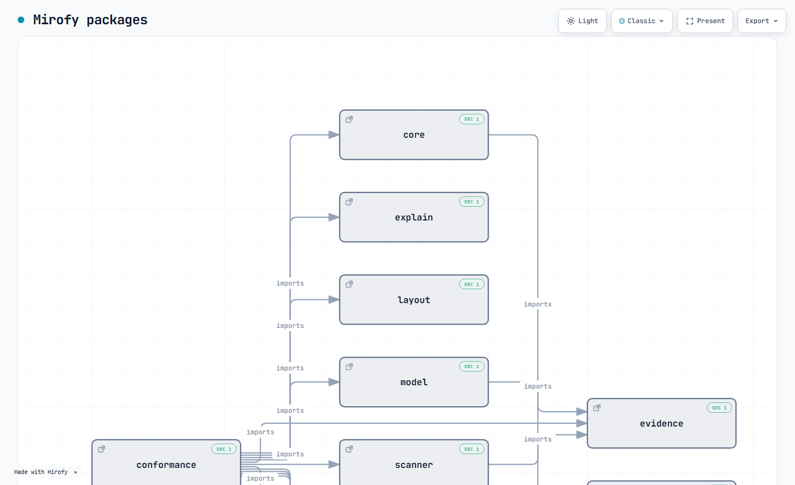
</p>

<p align="center">
  <strong>One file. No server — and nothing it needs from the network.</strong>
  <br>
  <em>The diagram, the evidence, the search and every interaction are in the
  file. The one thing it ever asks the internet for is a webfont
  <strong>it does not wait for and does not need</strong>, and it falls back to
  your system monospace without it.</em>
  <br>
  <sub>Checked on every run by <code>scripts/check-readme-claims.mjs</code>,
  which fails the build the moment a reference appears that could block first
  paint or change what the diagram says — and which fails just as loudly if this
  sentence ever overstates what the artifact actually fetches.</sub>
</p>

<p align="center">
  <strong><a href="https://hasan-laraib.github.io/Mirofy/">All thirty are live ↗</a></strong> — five types × six
  presets, rebuilt from every commit.
</p>

### The viewer, actually being used

Not mock-ups. Every frame below is a capture of the shipped viewer, driven
through real clicks by `scripts/build-screenshots.mjs` — which fails rather than
reuse an old picture if a control is renamed or a panel stops opening, and
refuses to save a shot of a feature that did nothing.

<table>
<tr>
<td width="50%" valign="top">
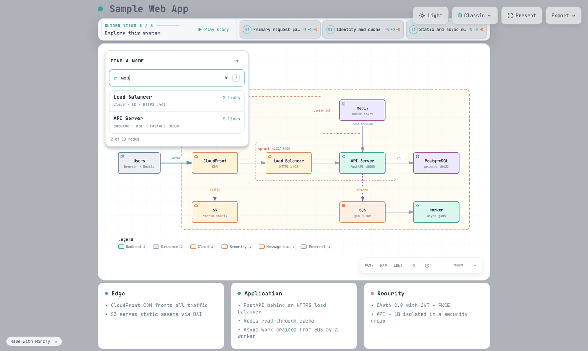
<p><strong>Find anything.</strong> Typing <code>api</code> narrows ten nodes to
two. The capture asserts the list actually shrank — a screenshot of an unfiltered
list is not a screenshot of search.</p>
</td>
<td width="50%" valign="top">
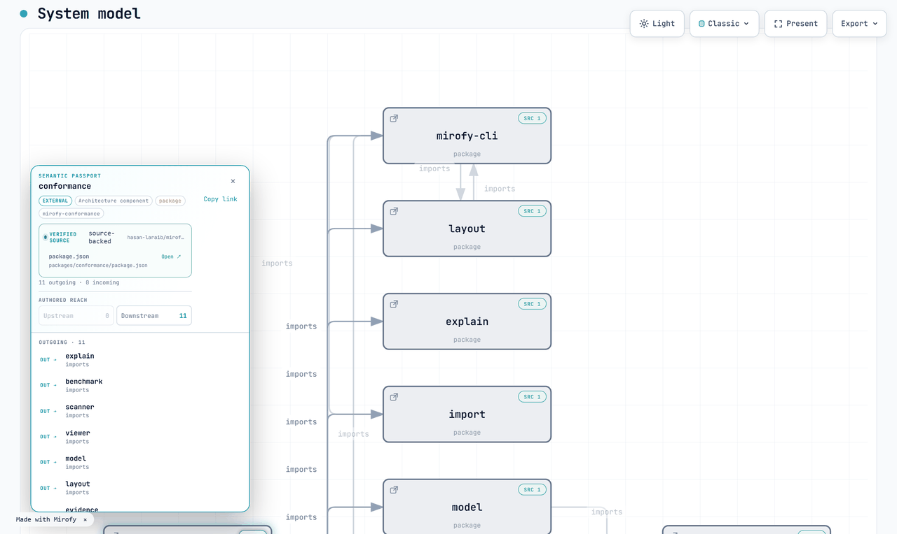
<p><strong>Ask a node where it came from.</strong> <code>conformance</code>,
<code>source-backed</code>, cited to <code>packages/conformance/package.json</code>
at a pinned commit. This one is captured from <em>this repository</em>, because
the authored example has no citations and a passport with the evidence missing
would illustrate the claim by not showing it.</p>
</td>
</tr>
<tr>
<td width="50%" valign="top">
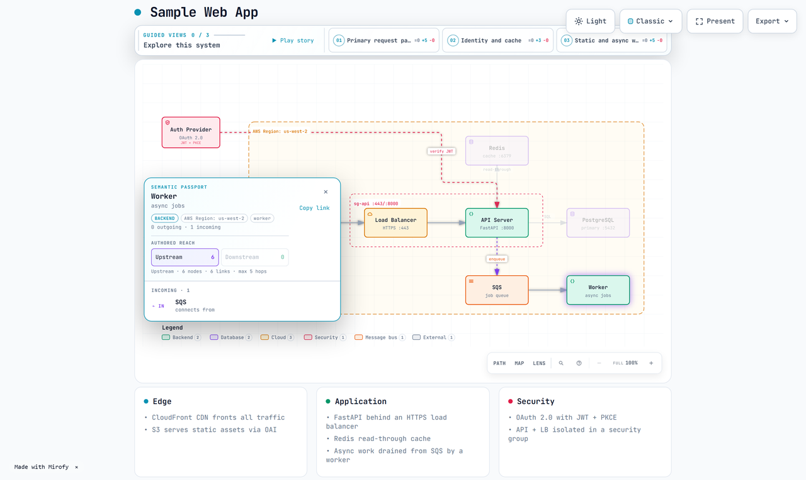
<p><strong>Follow what reaches what.</strong> Upstream of <code>Worker</code>:
six nodes, six links, five hops — lit, with everything off the path dimmed. The
capture picks the node with the <em>deepest</em> reach, so the picture is of a
path and not of one arrow.</p>
</td>
<td width="50%" valign="top">
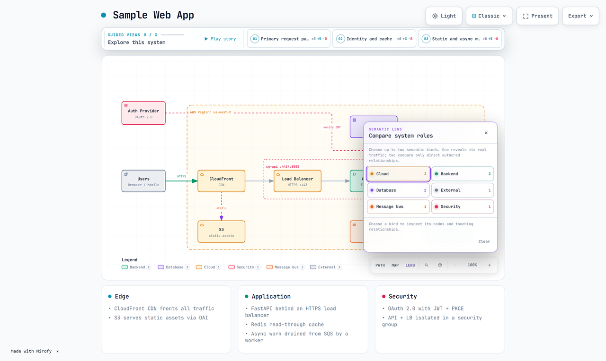
<p><strong>Compare roles across the whole system.</strong> The Semantic Lens
answers provenance and kind for every node at once, rather than one node at a
time.</p>
</td>
</tr>
</table>

---

## What it does that a diagram tool doesn't

### It refuses to guess

A file the scanner cannot parse becomes a recorded **gap**, never a silent
omission. Every fact is labelled with one of six provenance classes, so
`source-backed` and `inferred` never look alike.

The same rule holds where a decision has to be made that evidence cannot
settle. A derived component's kind is `package` — the scanner knows a manifest
exists, not whether something is a "backend". 784 imports of Node builtins are
*counted and named*, not drawn and not dropped in silence. In Python a computed
`importlib.import_module(name)` is a gap with its line, and docstrings are
blanked before parsing — a docstring full of example imports would otherwise
become edges the code does not have, cited to prose. A citation with no
pinned commit to verify against is discarded rather than shown, because a
citation nobody can check is worse than none — `map` reads the commit from
your `origin` remote, or takes `--repo-url` and `--revision` when there is no
remote to read.

A passport lists at most three sources, because forty-three links is not a
passport. It says **“Showing 3 of 43 cited sources”** when it does, so a bound on the
drawing is never mistaken for a claim about the evidence.

### It answers questions about your system

```bash
npm run explain -- callers api     # what points at api
npm run explain -- impact api      # what is downstream of it
npm run explain -- find payment    # id, label, kind or metadata match
npm run explain -- gaps            # what the scan could not read
```

Every answer names the unread files that could change it. *"Nothing calls
PaymentService"* is useful if the scanner read everything and reckless if six
files failed to parse — so an empty result means **not found**, never **does not
exist**.

`impact` answers as *reachability* and refuses to be more. What is connected is
a fact about the graph; whether a change breaks it is a judgement about a
running system, and Mirofy has no evidence for that.

### Your agent can ask too

The same queries over MCP — nine tools, the same engine, not a second
implementation that could disagree with the CLI:

```json
{ "mcpServers": { "mirofy": { "command": "node", "args": ["packages/mcp/bin/mcp.mjs"] } } }
```

The incompleteness warning is in the **prose** an agent reads, not only the
JSON. Most clients feed the text to the model and drop the rest.

### It checks architecture rules — with three outcomes, not two

```bash
npm run assert     # reads architecture-rules.json
```

`pass`, `fail`, and **`unproven`**. A rule that found no violation over a scan
with unread files has not been *shown* to hold, so it never counts as passing.
Turning a gap into a green check is the one failure this project exists to
avoid.

Some gaps are permanent — a dynamic import whose base path is a variable cannot
be resolved without guessing. Those can be **acknowledged**, one path at a
time, quoting the gap's reason and carrying a written argument. An
acknowledgement written for a dynamic import stops applying the day that file
fails to parse instead. And a rule that passes on the strength of one says so:

```
[ok  ] no-cycles — No violation. 8 unread file(s) are acknowledged as unable
       to hide one; this rests on that judgement, not on a complete scan.

2 passed, 0 failed, 0 unproven of 2
2 of those rule(s) rest on acknowledged gaps, not on evidence.
```

### It tells you what is moving

```bash
npm run timeline                                # cited-file churn, newest first
npm run drift -- --base a.json --head b.json    # what two scans say differently
```

Drift reports changed facts and nothing else — no score, no risk label, no merge
recommendation. It runs on every pull request and can never fail one.

---

## The number we would rather not publish

A benchmark asks one question: hand a model a written brief, and how often does
the diagram it writes come out **usable on the first attempt**?

Right now, over eight briefs authored by Claude Code: **2 of 8**.

```bash
node scripts/benchmark.mjs --author "<your command>" --model "<id>" --keep benchmarks/corpus/mine
node scripts/benchmark.mjs --replay benchmarks/corpus/mine
```

That is not a good number and it is the real one. Three things make it worth
printing anyway.

**Usable means clean, not accepted.** A warning is the diagram telling you it
needs a second look, which is exactly what a first-pass rate is supposed to
exclude. Two more documents in that set validate with zero errors and are still
not counted.

**It is measured against a saved corpus, not a fresh one.** `--keep` stores what
the model produced; `--replay` re-runs the tool over those exact documents
without calling the model again. Without that split, every re-run changes both
the documents and the tool, and any movement can be attributed to either — which
is why the rate sat at zero for weeks without anyone being able to say what was
wrong. A replay cannot even claim a different author: the model is read from the
saved manifest, and `--model` is refused if it disagrees.

**It moves for reasons you can name.** The last change to the layout engine took
the same eight documents from 0 of 8 to 2 of 8, and total composition errors
from 121 to 34, because a diagnostic that said *"shorten the label or widen
size"* was asking an author to rename part of their system to fit a box the
renderer had picked. The renderer now widens the box.

If you compare this to a number published elsewhere, check what was measured.
A rate for an agent that can call a validator and repair its own output, reviewed
by a person at the end, is a different measurement from a blind single-shot
model — not a worse one, a different one. Ours is the second kind.

---

## Inside the artifact

- **Node Finder**, **Semantic Lens**, **Semantic Radar** — search, filter and
  overview a diagram too large to read at once
- **Route Probe** — resolve a directed path and see it traced, hop by hop
- **Semantic Passport** — click a node for its type, tags and cited evidence,
  with a **Verified Source Beacon** on anything backed by a pinned commit
- **Your code, drawn apart from everyone else’s** — a module you wrote is
  solid, a third-party package is dashed. Not a colour: the colour-blind-safe
  preset already spends all seven of its hues on the seven semantic roles, so
  an eighth would be a distinction only some readers could see
- **Guided views**, presentation mode, motion governor, and `?embed=1`
- Three exports, copied straight to the clipboard:
  - **Export → Share Card** — a 1200×630 PNG in the current theme and preset
  - **Export → Route Share Card** — the exact route a Route Probe resolved
  - **Export → Reach Share Card** — the set a reachability query returned

A card shows what the reader actually did. None of them claim validation, and
none are produced from a query that returned nothing.

```bash
npm run gallery      # every type in every preset → preview/index.html
npm run build:site   # the same, plus this repo's self-model → site/
```

The second is what CI publishes to
**[hasan-laraib.github.io/Mirofy](https://hasan-laraib.github.io/Mirofy/)** on every commit. Nothing
is committed: the site is built from the code at the commit it describes, so it
cannot go on quietly describing an older one.

## Taking it elsewhere

The interactive file is ~720 KB and earns it. None of that survives a README, a
pull request or a Notion page, though — all of them strip scripts. So:

```bash
# 19 KB standalone SVG: no scripts, no stylesheet needed
node packages/core/bin/mirofy.mjs render architecture in.json out.svg --format svg-static

# or open it in an editor you already own
npm run export -- drawio     architecture in.json
npm run export -- excalidraw architecture in.json
```

| where it goes | how |
|---|---|
| README, pull request, Notion, Confluence | `svg-static` |
| Figma, Canva, Illustrator, Sketch | `svg-static` — styling is written as attributes, so it arrives with its colours |
| diagrams.net · draw.io VS Code extension | `drawio` — real shapes and connectors |
| Excalidraw · Obsidian · VS Code | `excalidraw` — bound arrows, movable boxes |

The SVG carries its styling **twice**: in a stylesheet and on the elements. In
SVG a stylesheet outranks an attribute, so a browser renders from the CSS, and
the attributes speak only where the CSS is ignored — which is exactly what
Figma, Canva and Illustrator do. Without them the diagram imports shape-correct
and colour-dead.

Both editor exports say exactly what they lost, computed from *your* document
rather than recited as a disclaimer. A diagram you can only edit in the tool
that made it is a diagram held hostage.

## What is proved

The conformance matrix has **103 rows**. **83 are proved without a browser**;
19 more need headless Chrome (`MIROFY_CHROME`), bringing the total to 102.

```bash
npm run check    # lint, types, 1,000+ tests, golden parity, conformance, size, audit
```

Every row names a test, and the title must match character-for-character — a row
whose proof file passes while its own test was renamed counts as **unproven**,
never as passing. One row (6.10, deterministic ZIP packaging) is UNPROVEN and
counted as such rather than quietly dropped.

**Skipped is not passed.** Browser rows never count toward the proved total
unless a browser actually ran them.

And the numbers on this page are checked too:

```bash
node scripts/check-readme-claims.mjs
```

It counts the matrix, reads the tool list the MCP server serves, renders an
artifact to measure it, and re-runs the benchmark. This exists because a review
found three numbers here wrong at once — none of them dishonest, all of them
true when written and left behind by the repository. A page that argues for
checking claims has no business making unchecked ones.

## Evidence and provenance

Six classes, never blurred:

| class | means |
|---|---|
| `authored` | a human wrote it |
| `source-backed` | read out of a cited file and line range |
| `statically-derived` | computed from code without running it |
| `config-derived` | read from a manifest — configuration, not code |
| `runtime-observed` | seen in a real run |
| `inferred` | a guess, and labelled as one |

Source citations verify against a pinned 40-character commit in a real local
checkout before they render. A path that does not exist at that revision is an
error, not a broken link.

Several repositories can be declared at once, and a citation names which one it
belongs to. Verifying against *a* repository rather than *the right one* is how
a path from a sibling repo passes as evidence for this one.

## Packages

| package | does |
|---|---|
| `scanner` | adapters that read a repository into facts and gaps |
| `evidence` | append-only evidence graph, query, honest coverage |
| `model` | the system model: stable ids, evidence refs, human overrides |
| `compile` | view compiler and the planner seam |
| `explain` | graph queries, architecture rules, drift, timeline |
| `mcp` | the model as agent context |
| `import` | Mermaid into typed documents |
| `export` | draw.io and Excalidraw escape hatches |
| `layout` | constraint layout: intent to coordinates (dev-time) |
| `core` | renderers, schemas, validators, CLI |
| `viewer` | the interactive viewer, built into one template |
| `benchmark` | first-pass usable rate, over a saved corpus |
| `conformance` | the matrix, and the tests every row names |

**Zero runtime dependencies** in every package. The artifact ships nothing but
itself.

`packages/core/assets/template.html` is **generated** from `packages/viewer/`.
Never edit it directly — edit the source and run `npm run build:template`.
`npm run check:template` rebuilds from source and fails if the committed file
has drifted.

## Attribution

Every artifact says what made it. The viewer footer is **dismissible** — the
diagram is yours, and a banner you cannot close is an imposition on someone
else's document. Share Cards carry a **permanent** one, because a card travels
without its context and lands where nothing says where it came from.

It names the tool and claims nothing about the diagram, and carries no URL: a
link baked into every shared artifact outlives the address it points at.

MIT. `packages/core/LICENSE` retains, verbatim, the required third-party
copyright notice for the imported rendering core; the root `LICENSE` covers this
project's own work.
